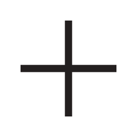
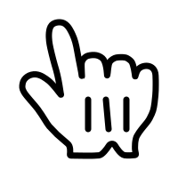

# Cursor Source Info

## Symbolic Cursors

|                          Preview                          |         Source          |                         Symbolic links                          | Windows Cursor name |
| :-------------------------------------------------------: | :---------------------: | :-------------------------------------------------------------: | :-----------------: |
|           |     all_scroll.svg      |                             `None`                              |    `SizeAll.cur`    |
|   | bottom_left_corner.svg  |          `fd_double_arrow.svg` `top_right_corner.svg`           |   `SizeNESW.cur`    |
|  | bottom_right_corner.svg |           `bd_double_arrow.svg` `top_left_corner.svg`           |   `SizeNWSE.cur`    |
|           |     bottom_tee.svg      |                             `None`                              |                     |
|           |     center_ptr.svg      |                             `None`                              |                     |
|               |       circle.svg        |             `crossed_circle.svg` `dnd_no_drop.svg`              |      `NO.cur`       |
|         |    context_menu.svg     |                             `None`                              |                     |
|                 |        copy.svg         |                         `dnd_copy.svg`                          |                     |
|                |        cross.svg        |                          `tcross.svg`                           |                     |
|            |      crosshair.svg      |                             `None`                              |     `Cross.cur`     |
|               |       dotbox.svg        |                             `None`                              |                     |
|                |        hand1.svg        |                             `None`                              |                     |
|                |        hand2.svg        |                             `None`                              |     `Hand.cur`      |
|             |      left_ptr.svg       |                             `None`                              |     `Arrow.cur`     |
|     |   left_ptr_watch.svg    |                             `None`                              |  `AppStarting.ani`  |
|            |      left_side.svg      |                        `right_side.svg`                         |                     |
|             |      left_tee.svg       |                             `None`                              |                     |
|                 |        link.svg         |                         `dnd_link.svg`                          |                     |
|             |      ll_angle.svg       |                             `None`                              |                     |
|             |      lr_angle.svg       |                             `None`                              |                     |
|                 |        move.svg         | `dnd_move.svg` `dnd_none.svg` `grabbing.svg` `pointer_move.svg` |                     |
|               |       pencil.svg        |                             `None`                              |  `Handwriting.cur`  |
|                 |        plus.svg         |                             `None`                              |                     |
|       |   question_arrow.svg    |                          `dnd_ask.svg`                          |     `Help.cur`      |
|            |      right_ptr.svg      |                             `None`                              |                     |
|            |      right_tee.svg      |                             `None`                              |                     |
|        |    sb_down_arrow.svg    |                             `None`                              |                     |
|    |  sb_h_double_arrow.svg  |                             `None`                              |    `SizeWE.cur`     |
|        |    sb_left_arrow.svg    |                             `None`                              |                     |
|       |   sb_right_arrow.svg    |                             `None`                              |                     |
|          |     sb_up_arrow.svg     |                             `None`                              |    `UpArrow.cur`    |
|    |  sb_v_double_arrow.svg  |                             `None`                              |    `SizeNS.cur`     |
|             |      top_side.svg       |                        `bottom_side.svg`                        |                     |
|              |       top_tee.svg       |                             `None`                              |                     |
|             |      ul_angle.svg       |                             `None`                              |                     |
|             |      ur_angle.svg       |                             `None`                              |                     |
|        |    vertical_text.svg    |                             `None`                              |                     |
|               |        wait.svg         |                             `None`                              |     `Wait.ani`      |
|       |   wayland_cursor.svg    |                             `None`                              |                     |
|             |      x_cursor.svg       |                             `None`                              |                     |
|                |        xterm.svg        |                             `None`                              |     `IBeam.cur`     |
|              |       zoom_in.svg       |                             `None`                              |                     |
|             |      zoom_out.svg       |                             `None`                              |                     |

## Figma File

